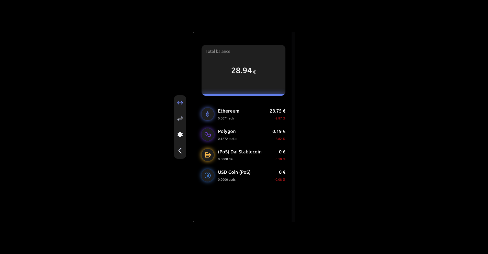

<h1 align="center">
  Web3 hot wallet
</h1>

## 👾 About

a simple full-stack, pwa, Ethereum and Polygon wallet, developed with Next.js.

#### Features:
- generating and restoring wallets
- sending transaction
- scanning wallets qr code
- integration with 1inch swap (coming soon)

#### Main libraries:
- Next.js
- Crypto-js
- Web3.js

## 🚀 Cloning guide

1.  **Clone the code**

    Use git to clone the website code.

    ```shell
        git clone https://github.com/amir4rab/web3wallet
        cd web3wallet
    ```

2.  **Add environment variables**

    You need to setup a moralis account and, get your web3 api key and your nodes key.
    ```javascript
        MORALIS_API_KEY = 'your web3 api key'
        NEXT_PUBLIC_MORALISNODESKEY = 'your node api key'

        NEXT_PUBLIC_DOMAIN= 'your domain'
    ```

3.  **Installing the dependencies**
    then write the following command:
    ```shell
      npm install
    ```

4. **Start developing**
    Everything is almost ready, just type the following command:
    ```shell
      npm run dev
    ```
    Your site is now running at http://localhost:3000

## Learn More

Learn more about main Libraries:

- [Next.js Documentation](https://nextjs.org/docs).
- [Web3.js Documentation](https://web3js.readthedocs.io/en/v1.3.4/web3.html)
- [Crypto-jS Documentation](https://cryptojs.gitbook.io/docs)